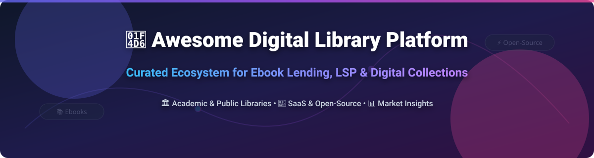

  

  
  
  
  
  
  

# 📚 Awesome Digital Library Platform Ecosystem 🚀

> 💡 **A curated directory of SaaS platforms, open-source software, digital asset repositories, and library services platforms (LSP) for public, academic, and enterprise digital library infrastructure.**

*✨ Focused on Ebook Lending, Digital Content Platforms, Academic eBook Access, PressReader-Style Delivery & Library Digital Collections ✨*  

**📅 Last updated: October 2026**

---

## 📑 Table of Contents
- [📊 Market Overview](#-market-overview)
- [🏢 SaaS & Hosted Platforms](#-saas--hosted-platforms)
- [🔓 Open-Source Projects](#-open-source-projects)
- [🏗️ Architecture & Composable Stacks](#%EF%B8%8F-architecture--composable-stacks)
- [🤝 How to Contribute](#-how-to-contribute)
- [⚠️ Disclaimer](#%EF%B8%8F-disclaimer)
- [💖 Support & Buy Me a Coffee](#-support--buy-me-a-coffee)
- [📈 Star History](#-star-history)

---

## 📊 Market Overview

The global **Digital Library Platform Market** is estimated at **~$8.94 Billion** (projected to reach **$13.77 Billion by 2030** at an 11.6% CAGR). 📈

> 🧩 **Market Fragmentation:** The sector is **highly fragmented** across specialized verticals (public library lending, higher education eTextbooks, academic institutional repositories, and digital newsstands). While individual niches feature strong enterprise anchors (such as OverDrive in public libraries or Clarivate/ProQuest in academia), the broader ecosystem lacks a single "winner-take-all" platform due to complex publisher copyright DRM, varied institutional purchasing workflows, and distinct patron access requirements.

---

## 🏢 SaaS & Hosted Platforms

| 🌐 Platform | 🎯 Focus / Category | 💰 Company Size / Valuation / Revenue | 🏷️ Starting Price | 🎁 Free Tier / Trial Limit |
| :--- | :--- | :--- | :--- | :--- |
| **[ProQuest Ebook Central / EBSCO eBooks](https://about.proquest.com/)** | Academic ebook aggregators & library discovery integration. | **Enterprise Conglomerate** (~$875M+ annual revenue; Clarivate parent ~$2.6B revenue) | Custom institutional quotes starting around $1,000–$2,000/year base access plus title acquisition | No free tier; custom demo environments available for institution evaluation upon request |
| **[OverDrive / Odilo / Wheelers](https://www.overdrive.com/)** | Public & school library digital lending (ebooks, audiobooks, magazines). | **Large Market Leader** (~$150M+ annual revenue estimate; PE-backed by KKR) | Starts at ~$500/year platform fee + title licensing costs (OC/OU, CPC, Metered Access) | No universal free trial; demo access and promotional sample collections available upon institutional contact |
| **[VitalSource / Kortext / BibliU](https://www.vitalsource.com/)** | Higher education inclusive-access & eTextbook reader platforms. | **Mid-Market Leader** (~$80M–$100M annual revenue estimate) | Individual eTextbook rentals starting at ~$15.00/title; institutional inclusive access varies by course | Free use of Bookshelf app; 14-day free trial / instant sample chapters on select eTextbooks |
| **[PressReader](https://www.pressreader.com/)** | Digital newspapers & magazines platform for libraries & individual patrons. | **Mid-Market Enterprise** (~$40M–$50M annual revenue estimate) | $29.99/month for Premium individual access (Institutional pricing starting ~$1,500/year) | 7-day free trial for Premium subscription with full access to 7,000+ publications |
| **[Perlego](https://www.perlego.com/)** | Student & academic digital textbook subscription platform. | **Venture-Backed Scaleup** (~$30M–$40M annual revenue; >$90M funding raised) | $18.00/month (or ~$12.00/month billed annually at $144/year) | 14-day free trial with full access to textbook library (payment details required) |

---

## 🔓 Open-Source Projects

Below is a list of top open-source library systems, institutional repository software, self-hosted ebook servers, and discovery platforms, sorted by GitHub Stars_Count. ⭐

| 💻 Repository | 📝 Description | 🏷️ Category | ⭐ Stars_Count |
| :--- | :--- | :--- | :--- |
| **[Calibre-Web](https://github.com/janeczku/calibre-web)** | Web interface for browsing, reading, and downloading eBooks using a Calibre database. | Self-Hosted Reader |  |
| **[Kavita](https://github.com/Kareadita/Kavita)** | Self-hosted digital library and reader for comics, manga, and ebooks with multi-user support. | Self-Hosted Reader |  |
| **[Audiobookshelf](https://github.com/advplyr/audiobookshelf)** | Self-hosted media server for audiobooks and podcasts with mobile app sync. | Self-Hosted Audio/Ebook |  |
| **[Audiblez](https://github.com/carlroetto/audiblez)** | Tool to generate audiobooks from e-books using text-to-speech AI voices. | Ebook Tooling |  |
| **[Stash](https://github.com/stashapp/stash)** | An organizer for your digital media collection with web UI and metadata management. | Digital Asset Management |  |
| **[VuFind](https://github.com/vufind-org/vufind)** | Open-source library search engine designed for libraries to query physical & digital resources. | Discovery Layer |  |
| **[DSpace](https://github.com/DSpace/DSpace)** | Institutional repository software for preserving academic publications, datasets, & archives. | Repository Software |  |
| **[Blacklight](https://github.com/projectblacklight/blacklight)** | Multi-repo Solr-based discovery interface used by academic libraries and archives. | Discovery Layer |  |
| **[Invenio RDM](https://github.com/inveniosoftware/invenio-rdm-records)** | Open-source framework powering Zenodo research data repositories and digital libraries. | Repository Framework |  |
| **[Islandora](https://github.com/Islandora/Islandora)** | Open digital repository system based on Drupal, Fedora Commons, and Solr. | Digital Preservation |  |
| **[Evergreen](https://github.com/evergreen-library-system/Evergreen)** | Scalable open-source ILS designed for public library consortia and shared catalogs. | Integrated Library System |  |
| **[FOLIO](https://github.com/folio-org/folio-analytics)** | Open-source Library Services Platform (LSP) for modern electronic resource management (ERM). | Library Services Platform |  |
| **[Koha](https://gitlab.com/koha-community/koha)** | World's first open-source ILS powering thousands of public, school, and special libraries globally. | Integrated Library System | [GitLab Mirror](https://gitlab.com/koha-community/koha) |

---

## 🏗️ Architecture & Composable Stacks

Libraries typically deploy a **composable digital library architecture**: 🧩
- 🛠️ **Integrated Library Systems (ILS / LSP)**: *Koha*, *FOLIO*, or *Evergreen* for operations, circulation, and patron management.
- 📁 **Institutional Repositories**: *DSpace*, *Invenio*, or *Islandora* for open access research, electronic theses/dissertations (ETD), and digitized archives.
- 🔍 **Discovery Layer**: *VuFind* or *Blacklight* to aggregate physical books, open-access repos, and licensed commercial ebooks into one search portal.
- 🔌 **Commercial SaaS Integration**: APIs to *OverDrive*, *ProQuest*, *EBSCO*, and *PressReader* for DRM-protected commercial publisher catalogs.

---

## 🤝 How to Contribute

1. 🍴 Fork this repository.
2. ✏️ Add or update entries in `README.md` maintaining the table format.
3. 📌 Include title, official link, Stars_Badge (for open source), category, and pricing/revenue info.
4. 📥 Submit a Pull Request with a short summary.

---

## ⚠️ Disclaimer

- ℹ️ This curated list is maintained for educational and informational purposes for librarians, library IT specialists, and software engineers.
- 🏷️ All trademarks and brand names belong to their respective owners.
- 🔒 Commercial publisher ebook licensing requires active institutional agreements and compliance with digital rights management (DRM).

---

## 💖 Support & Buy Me a Coffee

Thank you for exploring this project! If you found this list helpful, please consider **starring (⭐)** the repository, **forking (🍴)** it, or **sharing (📢)** it with fellow librarians, developers, and tech enthusiasts.

Your support helps keep this directory active and up to date! 🚀

---

## 📈 Star History

